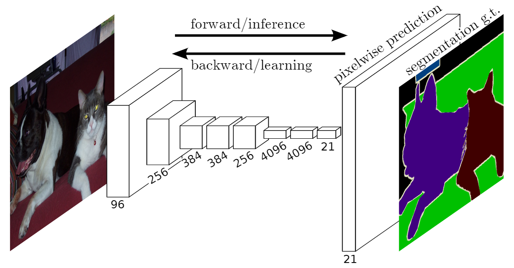
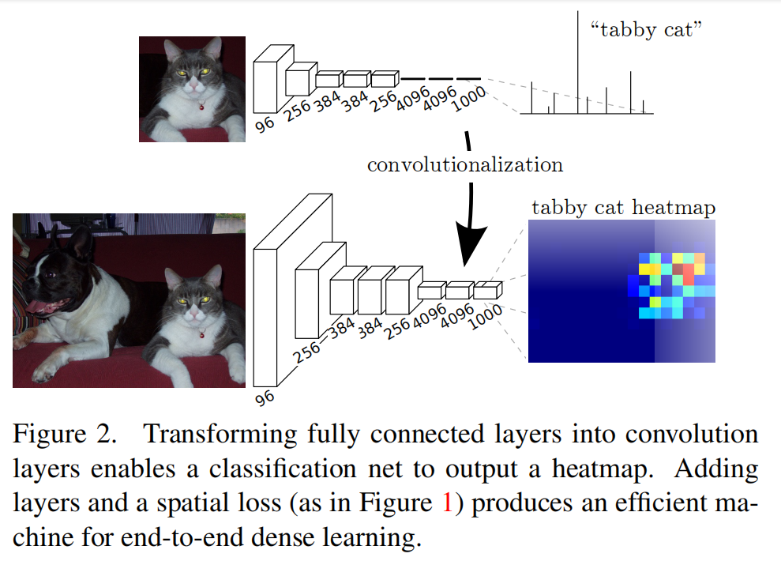
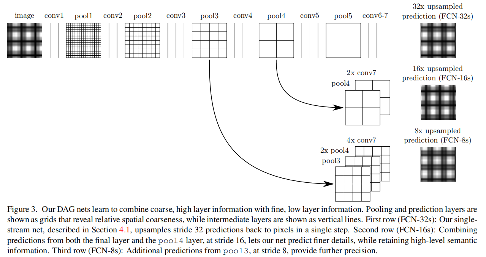
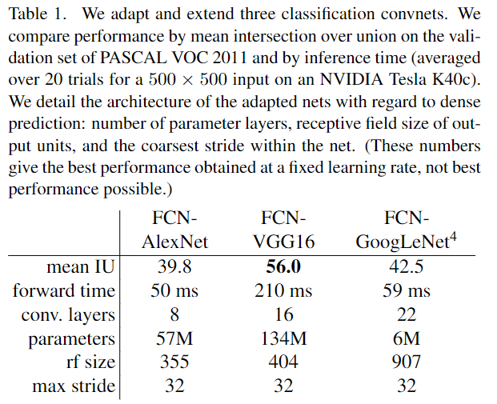
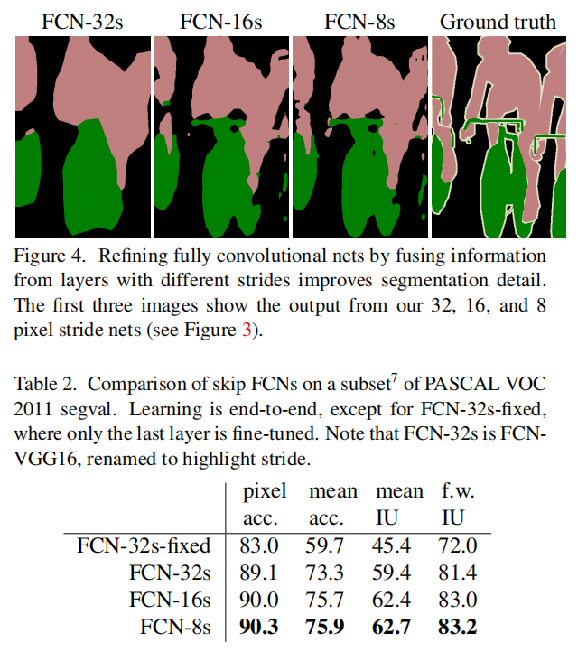

# Fully Convolutional Networks for Semantic Segmentation

## 目录

- [Fully Convolutional Networks for Semantic Segmentation](#fully-convolutional-networks-for-semantic-segmentation)
  - [目录](#目录)
  - [速览](#速览)
  - [摘要](#摘要)
  - [引言](#引言)
  - [相关工作](#相关工作)
  - [全卷积网络](#全卷积网络)
  - [分割结构](#分割结构)
    - [从分类器到稠密的 FCN](#从分类器到稠密的-fcn)
    - [将 what 和 where 结合](#将-what-和-where-结合)
    - [实验框架](#实验框架)
  - [实验](#实验)
    - [数据集](#数据集)
    - [测试阶段](#测试阶段)
    - [评估指标](#评估指标)
  - [结果](#结果)
  - [总结](#总结)
  - [生词](#生词)

## 速览

| 被引  | 下载                                                                                                                   | 收录                                                                                                                                 | 源码       | 数据       | 引用                |
| ----- | ---------------------------------------------------------------------------------------------------------------------- | ------------------------------------------------------------------------------------------------------------------------------------ | ---------- | ---------- | ------------------- |
| 27180 | [thecvf](https://openaccess.thecvf.com/content_cvpr_2015/papers/Long_Fully_Convolutional_Networks_2015_CVPR_paper.pdf) | [CVPR 2015](https://openaccess.thecvf.com/content_cvpr_2015/html/Long_Fully_Convolutional_Networks_2015_CVPR_paper.html)（视觉顶会） | [GitHub]() | [Kaggle]() | BibTeX 引用格式如下 |

```BibTeX
@inproceedings{long2015fully,
  title={Fully convolutional networks for semantic segmentation},
  author={Long, Jonathan and Shelhamer, Evan and Darrell, Trevor},
  booktitle={Proceedings of the IEEE conference on computer vision and pattern recognition},
  pages={3431--3440},
  year={2015}
}
```

## 摘要

1. 主要成就

端到端训练方式下的卷积网络超过了现有语义分割的最先进技术。

2. 核心思想

构建了一个可以接受任意尺寸的输入，经过高效的推理和学习来生成对应尺寸输出的全卷积网络模型。

3. 主要方法

改造同时期的分类网络（AlexNet，VGG net 和 GoogLeNet），通过微调将他们学习到的特征转移到分割任务中。并设计了一个跳跃连接，可以将来自深层的的语义信息与来自浅层的表征信息结合起来，相互补偿，以产生准确和精细的分割。

4. 实验结果

在 PASCAL VOC 2012 数据集上，获取了最大的 mean IU 指标，并且推理时间也不到原来的五分之一。

## 引言

首先，介绍了卷积网络在识别技术中的应用。

然后，提出了 FCN，其网络结构如下：



这是以端到端的方式训练全卷积网络的首次尝试：（1）像素级的预测；（2）使用监督的预训练。

语义分割面临着语义和位置之间的内在冲突，具体表现为：

> global information resolves what while local information resolves where.

深层特征在非线性的局部到全局金字塔中编码位置和语义。因此，作者定义了一个跳跃连接来利用这种特性，它结合了深层的语义信息和浅层的表征信息。

最后，介绍了文章的组织结构。

## 相关工作

介绍了前人使用全卷积网络进行稠密预测（语义分割）的一些工作，前人的工作大多具有以下特点：

- 模型的感受野很小
- patch 级别的训练
- 需要很多后处理（超像素投影、滤波和局部分类）
- 需要很多预处理（输入平移、输出交错和多尺度金字塔处理）

而 FCN 没有这些缺点，它使用预训练的分类网络提取特征，然后微调全卷积网络。

## 全卷积网络

首先，将分类网络中最后的全连接层改为卷积层，这样就能得到一个特征图



然后，对上一步得到的特征图进行上采样。上采样有两种选择，一种是固定的插值算法，比如双线性插值，另一种是反卷积。反卷积层也是有参数的，也就是说它可以进行学习，再加上激活函数，就能实现一个非线性的上采样算法。

## 分割结构



### 从分类器到稠密的 FCN

首先，选择了如下的分类网络：

- AlexNet
- VGG16（在语义分割任务上 VGG19 性能差不多）
- GoogLeNet（只用最后的 loss 层，不要最后的平均池化层）

然后，将上一步选择的分类网络提取的粗的特征图输入到一个 1x1 卷积层中，其输出通道数是 21，用于预测 PASCAL 类别（包括背景）分数。紧接着一个反卷积层，将特征图上采样到像素密集的输出。



### 将 what 和 where 结合



### 实验框架

- 优化器
  - SGD
    - momentum：0.9
    - weight decay：5<sup>-4</sup>或者2<sup>-4</sup>
    - 固定学习率
      - FCN-AlexNet：10<sup>-3</sup>
      - FCN-VGG16：10<sup>-4</sup>
      - FCN-GoogLeNet：10<sup>-5</sup>
- 初始化
  - 使用0而不是随机初始化 class scoring layer

## 实验

### 数据集

> 38-Cloud: A Cloud Segmentation Dataset：点击[这里](https://www.kaggle.com/sorour/38cloud-cloud-segmentation-in-satellite-images)从 Kaggle 下载

共 38 景 Landsat 8 的图像。18 张用于训练，20 张用于测试。作者手工标注了 18 张训练图像，20 张测试图像没有手工标注，其标签是由改进的 Fmask 算法自动生成的。裁剪尺寸是 384×384，裁剪之后得到 8400 张训练图像，9201 张测试图像。

### 测试阶段

将测试集图片 resize 到 192×192，喂给训练好的模型，对网络预测的概率图进行二值化（阈值：0.047），然后 resize 到 384×384，最后拼接到原图的大小。**（这里有两点疑问：（1）二值化阈值为什么要选择 0.047？（2）图片裁剪制作 patch 采用的是不重叠的方法，对于无法整除 384 的大图该如何裁剪，裁剪后又该如何拼接成原图的大小？）**

| 1                                                                                 | 2                                                                                 |
| --------------------------------------------------------------------------------- | --------------------------------------------------------------------------------- |
|  |  |

<center>图2 Cloud-Net 测试结果。a 和 e 是自然彩色图像，b 和 f 是对应的 GTs，c 和 g 是 FCN 的结果，d 和 h 是本文算法的结果</center>

### 评估指标

- Jaccard Index（IOU）
- Precision
- Recall
- Specificity
- Overall Accuracy


## 结果


## 总结

本文提出了一个基于深度学习的遥感图像云分割算法。与论文[[13]](https://arxiv.org/pdf/1810.05782)中的FCN 相比，具有更好的性能。并对论文[[13]](https://arxiv.org/pdf/1810.05782)的数据集进行了改进。

## 生词

- exceed：超过
- insight：洞察力；领悟；了解
- arbitrary：武断的；任意的
- draw connections to prior models：与先前的模型建立联系
- contemporary：同时期的
- inherent：固有的；内在的；天生的
- tension：紧张关系；矛盾；冲突
- investigation：调查；学术研究
- discard：丢弃
- comparable：类似的；可比较的
